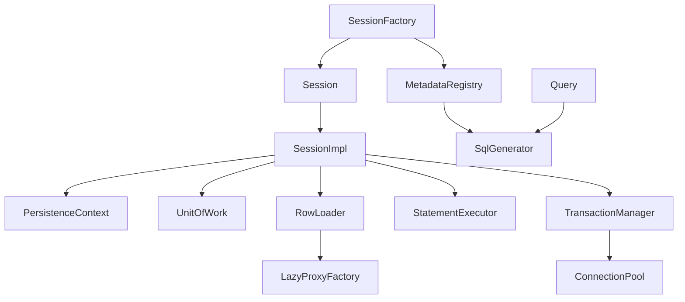

# MicroORM

[](https://openjdk.org/)
[](https://github.com/actions/workflows/build.yml)

ORM для PostgreSQL на голом JDBC: 81 класс, 6400 строк, 351 тест, покрытие 93% строк. Зависимости —
`byte-buddy` для ленивых прокси и `slf4j-api`. Java 21, Maven, PostgreSQL 16, JUnit 5 + Testcontainers.

## Quick start

```java
SessionFactory factory = SessionFactory.builder()
        .connectionPool(dataSource, PoolConfig.builder().minSize(2).maxSize(8).build())
        .build();

try (Session session = factory.openSession()) {
    session.beginTransaction();
    session.persist(new User("ann@example.com", "Ann", 30, true));   // id сгенерирует БД
    session.commit();
}

try (Session session = factory.openSession()) {
    User ann = session.findOrThrow(User.class, 1L);
    ann.setName("Anna");                        // UPDATE только name + version
    session.beginTransaction();
    session.commit();

    List<User> adults = session.createQuery(User.class).where("age", ">", 18)
            .and("active", "=", true).orderBy("name", SortDirection.ASC).limit(10).list();
}
```

Пример выполняется тестом [`ReadmeExampleTest`](src/test/java/io/microorm/session/ReadmeExampleTest.java),
поэтому README не может разойтись с кодом.

## Как это работает

**Persistence context.** Одна строка — один объект в сессии, второй `find` того же id не выполняет SQL.

**Dirty checking и блокировка.** При загрузке снимается снимок значений, на `flush()` собирается
`UPDATE ... SET name = ?, version = ? WHERE id = ? AND version = ?` — только изменившиеся колонки.
Вернули поле к исходному значению — `UPDATE` не выполнится; ноль затронутых строк — строку изменили в
другой транзакции.

**Lazy loading.** ByteBuddy генерирует подкласс сущности; первый вызов загружает объект, дальше вызовы
делегируются ему. Состояние не копируется — иначе запись через ссылку не дошла бы до unit of work.
`getId()` отвечает из поля без SELECT, после `close()` сессии — `LazyInitializationException`.

**Connection pool.** Свой, без HikariCP: `minSize`/`maxSize`, health-check через `SELECT 1`, вытеснение
по `idleTimeout` и `maxLifetime`, метрики. `close()` у `java.sql.Connection` переопределяется динамическим
прокси — 50 делегирующих методов ради одной изменённой семантики не имеют смысла.

**Транзакции и запросы.** Вложенные транзакции — savepoint'ы, откат внутренней отменяет только её
работу, а незавершённая транзакция откатывается при закрытии сессии. Значения запросов идут только
bind-параметрами, колонки — из метаданных, так что неизвестная колонка отбрасывается при построении
запроса, а не сервером.

## Архитектура



`SessionImpl` не знает про SQL-текст, `SqlGenerator` — про сессию. Поэтому генерация SQL и поиск
изменившихся колонок покрыты тестами без базы, а весь JDBC живёт в `RowLoader` и `StatementExecutor`.

## Чего нет

| | Почему |
|---|---|
| `@OneToMany`, `@ManyToMany` | коллекция требует отслеживания изменений элементов; аннотация падает при разборе метаданных, а не в проде |
| наследование, кэш 2 уровня, каскады | каждый добавляет слой к SQL-генератору и dirty checking |
| MySQL, Oracle | нужен второй `Dialect`, а непроверенная реализация — мёртвый код |
| `Session.find` как `T` | возвращает `Optional<T>`: публичный API без `null` |

## Бенчмарки

`find` по идентификатору, одинаковый пул и SQL, unit of work на каждую операцию:

| | мкс/оп | к JDBC |
|---|---:|---:|
| чистый JDBC | 202,5 | 1,00× |
| MicroORM | 257,3 | 1,27× |
| MicroORM, второй `find` | 238,3 | 1,18× |

PG 16.2, JMH 1.37, 2 форка. Hibernate не сравнивал — его нет в classpath.

## Тесты

`mvn clean verify` — 294 юнит-теста на скриптованном JDBC и 57 интеграционных на Testcontainers.
Без Docker: `mvn clean verify -Dmicroorm.jdbcUrl=jdbc:postgresql://localhost:5432/microorm`.