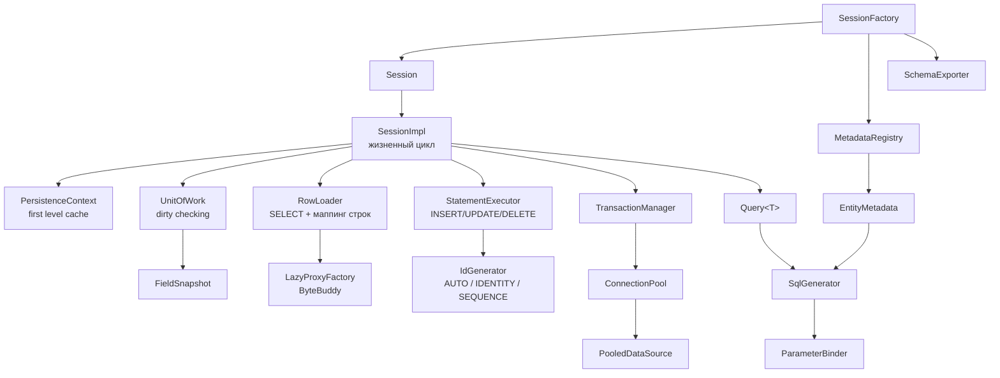

# MicroORM

[](https://openjdk.org/)
[](https://github.com/actions/workflows/build.yml)
[](LICENSE)
[](pom.xml)

Учебный мини-ORM поверх чистого JDBC: только `java.sql`, стандартная библиотека, SLF4J и ByteBuddy
для ленивых прокси. Ни Hibernate, ни JPA, ни Spring, ни Lombok, ни HikariCP.

```
Java 21 · Maven · PostgreSQL · 351 тест: 294 юнит + 57 интеграционных · покрытие 93% строк
```

## Зачем

Hibernate удобен ровно настолько, насколько непрозрачен. Когда ORM делает `UPDATE` по всем колонкам,
а запрос уходит в базу дважды, разобраться без понимания внутренностей почти невозможно.

MicroORM решает задачу в обратную сторону: те же механизмы, но явно и в объёме, который читается за
вечер. Каждое решение снабжено комментарием с причиной, каждый механизм покрыт тестом на конкретное
поведение. Это не замена Hibernate — после чтения вы сможете объяснить, почему `find` вернул тот же
объект, который вы уже меняли, и почему два потока на одной строке приводят к
`OptimisticLockException`.

## Quick start

```java
PGSimpleDataSource dataSource = new PGSimpleDataSource();
dataSource.setUrl("jdbc:postgresql://localhost:5432/microorm");

SessionFactory factory = SessionFactory.builder()
        .connectionPool(dataSource, PoolConfig.builder().minSize(2).maxSize(8).build())
        .entities(User.class, Order.class)
        .build();

try (Session session = factory.openSession()) {
    session.beginTransaction();
    session.persist(new User("ann@example.com", "Ann", 30, true));   // id сгенерирует БД
    session.commit();
}

try (Session session = factory.openSession()) {
    User ann = session.findOrThrow(User.class, 1L);                  // кэш первого уровня
    ann.setName("Anna");

    session.beginTransaction();
    session.commit();                                                 // UPDATE только name + version

    List<User> adults = session.createQuery(User.class)
            .where("age", ">", 18)
            .and("active", "=", true)
            .orderBy("name", SortDirection.ASC)
            .limit(10)
            .list();
}
```

Схему можно вывести из метаданных:

```java
factory.schemaExporter().exportToConsole(factory.knownEntities());
```

Пример выполняется тестом [`ReadmeExampleTest`](src/test/java/io/microorm/session/ReadmeExampleTest.java),
те же сценарии против настоящего PostgreSQL — в [`CrudIT`](src/test/java/io/microorm/it/CrudIT.java).

## Архитектура



Главное решение: **`SessionImpl` ничего не знает про SQL-текст, а `SqlGenerator` — ничего про сессию.**
Первый занимается жизненным циклом, второй превращает метаданные и значения в запрос. Поэтому
«какие колонки считаются изменёнными» проверяется юнит-тестом без базы.

## Как это работает

**Метаданные.** `MetadataParser` обходит поля и строго решает: `@Id` (тип `Long`, `Integer` или
`UUID`), `@Version` (целочисленный), `@ManyToOne` (колонка `<поле>_id`), базовый тип — обычная колонка,
всё остальное — `MappingException` со списком допустимых вариантов. Ошибки маппинга возникают при
первом обращении, а не посреди транзакции. Имена таблиц и колонок по умолчанию — `snake_case`, поэтому
всё, что попадает в SQL, проходит `IdentifierValidator`. Результат кэшируется в `ConcurrentHashMap`:
парсинг одного класса случается ровно один раз.

**Persistence context.** `Map<Class, Map<Id, Entity>>` внутри сессии даёт две гарантии: одна строка —
один объект (поэтому изменение видно через все ссылки) и ноль повторных `SELECT`. Если строка читается
повторно, а объект уже управляется, побеждает **управляемый** — иначе `find` выдал бы второй объект
той же строки, а dirty checking увидел бы только более новый.

**Dirty checking.** Снимок значений снимается при загрузке; на `flush()` текущие значения сравниваются
со снимком, и `UPDATE` упоминает только изменившиеся колонки плюс `version = version + 1`, а в `WHERE`
добавляется `AND version = <загруженная версия>`. Отсюда и поведение: если вернуть поле к исходному
значению, `UPDATE` не выполнится вообще. `UnitOfWork` не знает про JDBC — он возвращает
`List<Change>`, поэтому «какие колонки изменились» тестируется без базы.

**Lazy loading.** ByteBuddy генерирует подкласс сущности; все методы, кроме геттера идентификатора,
перехватываются. Первый вызов загружает объект, дальше вызовы **делегируются** ему — копия состояния не
заводится, иначе запись через ссылку не дошла бы до unit of work. `getId()` отвечает из поля и не
вызывает SELECT. Классы прокси кэшируются по типу. После `close()` сессии обращение к прокси даёт
`LazyInitializationException` — то самое поведение, ради которого в Hibernate придумали
`OpenSessionInView`.

**Connection pool.** Пять задач: держать от `minSize` до `maxSize` соединений, выдавать и забирать,
блокировать вместо бесконечного роста, проверять переиспользуемое соединение `SELECT 1` и списывать
вышедшие из строя. `java.sql.Connection` — интерфейс, поэтому `close()` переопределяется динамическим
прокси: писать 50 делегирующих методов ради одной изменённой семантики — плохая сделка. Истечение
ленивое (при ближайшем borrow/return), а `PoolConfig` принимает `Clock`, поэтому таймауты проверяются
без `sleep`.

**Транзакции.** Вложенность реализована savepoint'ами — единственное, что умеет JDBC. Откат вложенной
транзакции отменяет только внутреннюю работу, внешняя остаётся валидной. Незавершённая транзакция
откатывается при закрытии сессии, а провалившийся flush помечает транзакцию как doomed, чтобы
нельзя было продолжить поверх половины записанного.

## Что не поддерживается

| | Почему |
|---|---|
| `@OneToMany`, `@ManyToMany` | Коллекция требует отслеживания изменений её элементов — самая «невидимая» магия в ORM. Здесь аннотация приводит к `UnsupportedOperationException` при разборе метаданных, то есть проблема видна на старте. |
| Наследование сущностей | Каждая стратегия добавляет слой к SQL-генератору и к dirty checking. Одиннадцать строк «поддержки» означали бы три неразобранных подсистемы. |
| Кэш второго уровня | Требует инвалидации между процессами, то есть распределённой проблемы. Первое, что можно убрать и не потерять понимание основ. |
| MySQL / Oracle | Второй `Dialect`. Он есть как интерфейс из пяти методов, но непроверенная реализация — мёртвый код. |
| Каскады, `@Embedded`, составные ключи | Каждый добавляет свой путь маппинга и свои правила dirty checking. Каскадное удаление — политика, а не механизм, и должна жить в доменной модели. |

Осознанное отклонение от исходного ТЗ: `Session.find` возвращает `Optional<T>`, а не `T` — публичный API
без `null`. Для случая «обязательно должен существовать» есть `findOrThrow`.

## Бенчмарки

Три варианта, во всех трёх на каждой операции открывается и закрывается unit of work, пул и SQL
одинаковы. Разница — только накладные расходы ORM.

| Сценарий | мкс/оп | Error | к JDBC | SQL за операцию |
|---|---:|---:|---:|---:|
| `plainJdbcFindById` — тот же SQL через `PreparedStatement` | **202,5** | ± 42,3 | 1,00× | 1 |
| `microOrmFindById` — полный путь ORM | **257,3** | ± 56,1 | 1,27× | 1 |
| `microOrmFindByIdTwice` — второй `find` из кэша первого уровня | **238,3** | ± 65,1 | 1,18× | 1 |

```bash
mvn -q test-compile dependency:build-classpath -Dmdep.outputFile=target/cp.txt -Dmdep.includeScope=test
java -cp "target/classes:target/test-classes:$(cat target/cp.txt)" org.openjdk.jmh.Main \
    io.microorm.benchmark.FindByIdBenchmark -bm avgt -wi 5 -i 5 -w 2s -r 3s -f 2 -tu us
```

PostgreSQL 16.2, JMH 1.37, 2 форка. ORM дороже JDBC на ~27% — это цена за сессию, кэш, маппинг
8 колонок рефлексией и снимок для dirty checking. Второй `find` той же строки почти ничего не стоит
(257 → 238 мкс): SQL не выполняется вовсе. Абсолютные значения высокие потому, что база и клиент на
одной машине.

Hibernate в таблице нет: его нет в classpath, а мерить то, чего нет, — значит выдумывать числа.

## Тесты

```bash
mvn clean verify
```

Юнит-тесты (294) проверяют SQL-генератор, разбор метаданных, dirty checking, пул, транзакции, query
builder и прокси — без базы, на скриптованном JDBC. Интеграционные (57) поднимают Testcontainers с
`postgres:16-alpine` и проверяют то, что фейк принципиально не может: constraint violations,
конкуренцию двух потоков, savepoint через драйвер, `RETURNING`, обнаружение sequence через
`DatabaseMetaData`, поведение после убийства бэкенда.

Нужен PostgreSQL. По умолчанию его поднимает Testcontainers; если демона нет, тесты скипаются, а
сборка остаётся зелёной. Чтобы прогнать их без Docker:

```bash
mvn clean verify -Dmicroorm.jdbcUrl=jdbc:postgresql://127.0.0.1:5432/microorm \
  -Dmicroorm.jdbcUser=postgres -Dmicroorm.jdbcPassword=postgres
```

Схема применяется из того же `docker/init.sql` в обоих режимах.

## Что я узнал, написав свой ORM

**Юнит-тесты на фейке не заменяют настоящую баду.** Пул возвращал в idle свежую копию соединения, но
оставлял прежнюю в множестве учёта: проверка членства на втором `release` падала, и пул утекал до
полного насыщения. Юнит-тесты этого не видели — у них был замороженный `Clock`, а две копии с
одинаковым временем равны как records. Из того же прогона: `Long`-поле над `INTEGER`-колонкой, которое
драйвер конвертировать отказывается, — не экзотика, а обычное расхождение схемы и entity.
Фейк проверяет логику, база проверяет контракты с драйвером.

**Рефлексия не страшна, если результат кэшировать.** `Field.get` медленный, но разбор метаданных
происходит один раз на класс: всё, что читается в цикле, заранее превращается в `record` с готовым
`Field`.

**Идентичность объектов — то, что отличает ORM от обёртки над JDBC.** Кэш первого уровня стоит
несколько строк, но без него `find` после изменения объекта в другом месте вернул бы новый экземпляр,
и оптимистичная блокировка начала бы срабатывать ложно.

**Ленивая загрузка — не «null вместо объекта».** Прокси должен проходить `instanceof`, инициализироваться
один раз и честно падать после закрытия сессии. И он должен делегировать, а не копировать: копия —
это второй источник правды, и запись через ссылку в неё попадёт, а в базу — нет.

**Пул — это контракт о конкурентном доступе, а не коллекция.** `ReentrantLock` + `Condition` вместо
`wait/notify` — не стилистика: пул, создающий соединение без резервирования слота под лимит, в
нагрузке превысит `maxSize` мгновенно.

**«Грязные данные» в ORM — не то, что PostgreSQL называет dirty read.** Авто-`flush` перед чтением
внутри транзакции стоит дешевле, чем альтернатива: неожиданный `UPDATE` в конце транзакции.

## Лицензия

MIT — см. [LICENSE](LICENSE).