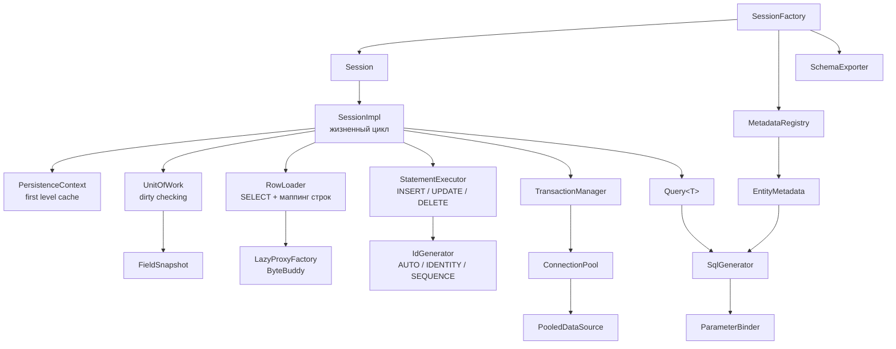

# MicroORM

[](https://openjdk.org/)
[](https://github.com/actions/workflows/build.yml)
[](LICENSE)

ORM для PostgreSQL, написанная с нуля на голом JDBC: 81 класс, ~6400 строк, 351 тест. Ни Hibernate,
ни JPA, ни Spring, ни Lombok, ни HikariCP — из зависимостей ровно две: `byte-buddy` и `slf4j-api`.

## Что это

Учебный проект с одной целью: показать изнутри то, что обычно прячет ORM. Реализованы ровно те
механизмы, из-за которых Hibernate кажется магией, но явно и в объёме, который читается за вечер:

- **Persistence context** — одна строка это один объект в пределах сессии, изменение видно через все ссылки.
- **Dirty checking** — `UPDATE` содержит только изменившиеся колонки, а не все.
- **Оптимистичная блокировка** — колонка `@Version`, конфликт даёт `OptimisticLockException`.
- **Lazy loading** — прокси на ByteBuddy, инициализация при первом обращении к свойству.
- **Connection pool** — свой, с health-check, вытеснением протухших соединений и метриками.
- **Транзакции** — вложенные через savepoint, уровни изоляции, откат при ошибке.

Проект не заменяет Hibernate. Он отвечает на вопрос: почему `session.find()` вернул тот же объект,
который ты уже менял, и почему два потока на одной строке приводят к конфликту.

**Стек.** Java 21 (records, sealed interfaces, pattern matching), Maven, `-Xlint:all -Werror`;
PostgreSQL 16, диалект вынесен в `Dialect`; тесты — JUnit 5, AssertJ, Testcontainers, JMH; покрытие —
JaCoCo с порогом 80%, фактически 93% строк и 84% ветвей.

## Быстрый старт

```java
PGSimpleDataSource dataSource = new PGSimpleDataSource();
dataSource.setUrl("jdbc:postgresql://localhost:5432/microorm");

SessionFactory factory = SessionFactory.builder()
        .connectionPool(dataSource, PoolConfig.builder().minSize(2).maxSize(8).build())
        .entities(User.class, Order.class)
        .build();

try (Session session = factory.openSession()) {
    session.beginTransaction();
    session.persist(new User("ann@example.com", "Ann", 30, true));   // id сгенерирует БД
    session.commit();
}

try (Session session = factory.openSession()) {
    User ann = session.findOrThrow(User.class, 1L);                  // кэш первого уровня
    ann.setName("Anna");

    session.beginTransaction();
    session.commit();                                                 // UPDATE только name + version

    List<User> adults = session.createQuery(User.class)
            .where("age", ">", 18)
            .and("active", "=", true)
            .orderBy("name", SortDirection.ASC)
            .limit(10)
            .list();
}
```

Схема выводится из метаданных: `factory.schemaExporter().exportToConsole(factory.knownEntities())`.

Пример выполняется тестом [`ReadmeExampleTest`](src/test/java/io/microorm/session/ReadmeExampleTest.java) —
README не может разойтись с кодом. Те же сценарии против настоящего PostgreSQL — в
[`CrudIT`](src/test/java/io/microorm/it/CrudIT.java).

## Как это работает

**Метаданные.** `MetadataParser` обходит поля и строго решает, что можно маппить: `@Id` (тип `Long`,
`Integer` или `UUID`), `@Version` (целочисленный), `@ManyToOne` (колонка `<поле>_id`), базовый тип —
обычная колонка. Всё остальное — `MappingException` со списком допустимых вариантов, причём при первом
обращении к сущности, а не посреди транзакции. Имена таблиц и колонок по умолчанию `snake_case`, так
что всё, что попадает в SQL, проходит `IdentifierValidator`. Метаданные кэшируются в
`ConcurrentHashMap`: разбор одного класса случается один раз.

**Persistence context.** `Map<Class, Map<Id, Entity>>` внутри сессии. Даёт две гарантии: одна строка —
один объект, и второй `find` того же id не выполняет SQL. Если строку читают повторно, побеждает уже
управляемый экземпляр — иначе `find` выдал бы второй объект той же строки, а dirty checking увидел бы
только более новый.

**Dirty checking.** При загрузке снимается снимок значений; на `flush()` текущие значения сравниваются с
ним, и собирается `UPDATE` только из изменившихся колонок. Отсюда поведение, которого нет в наивных
реализациях: вернули поле к исходному значению — `UPDATE` не выполнится вообще.

```java
User ann = session.findOrThrow(User.class, 1L);   // snapshot: {name=Ann, age=30, version=0}
ann.setName("Anna");
// UPDATE users SET name = ?, version = ? WHERE id = ? AND version = ?
//          [Anna]            [1]          [1]            [0]
```

`UnitOfWork` не знает про JDBC — он возвращает `List<Change>`, поэтому «какие колонки изменились»
покрыто юнит-тестами без базы.

**Lazy loading.** ByteBuddy генерирует подкласс сущности; перехватываются все методы, кроме геттера
идентификатора. Первый вызов загружает объект, дальше вызовы делегируются ему. Копия состояния не
заводится намеренно: копия — это второй источник правды, и запись через ссылку попала бы в неё, а в
базу — нет. `getId()` отвечает из поля и не выполняет SELECT. После `close()` сессии обращение к прокси
даёт `LazyInitializationException` — то самое поведение, ради которого в Hibernate придумали
`OpenSessionInView`.

**Connection pool.** Пять задач: держать от `minSize` до `maxSize` соединений, выдавать и забирать,
блокировать вместо неограниченного роста, проверять переиспользуемое соединение через `SELECT 1`,
списывать протухшие по `idleTimeout` и `maxLifetime`. `java.sql.Connection` — интерфейс, поэтому `close()`
переопределяется динамическим прокси: писать 50 делегирующих методов ради одной изменённой семантики —
плохая сделка, и production-пулы делают так же. Истечение ленивое, при ближайшем borrow/return, а
`PoolConfig` принимает `Clock`, поэтому таймауты проверяются без `sleep`.

**Транзакции и запросы.** Вложенность — через savepoint, единственное, что умеет JDBC; откат вложенной
транзакции отменяет только внутреннюю работу. Незавершённая транзакция откатывается при закрытии
сессии, а провалившийся flush помечает транзакцию как doomed. Query builder биндит значения только
параметрами, а колонки берёт из метаданных и проверяет тип значения: неизвестная колонка или оператор
отбрасываются при построении запроса, а не сервером.

## Архитектура



Главное решение: **`SessionImpl` ничего не знает про SQL-текст, а `SqlGenerator` — ничего про сессию.**
Первый занимается жизненным циклом, второй превращает метаданные и значения в запрос. Поэтому логика
генерации SQL и определение изменившихся колонок тестируются без базы, а весь JDBC живёт в `RowLoader`
и `StatementExecutor`. Пакеты — `annotation`, `metadata`, `session`, `transaction`, `pool`, `query`,
`sql`, `id`, `proxy`, `schema`, `exception`: один уровень, без вложенности.

## Чего нет и почему

| Не поддерживается | Причина |
|---|---|
| `@OneToMany`, `@ManyToMany` | Коллекция требует отслеживания изменений элементов — самая невидимая магия в ORM. Здесь аннотация даёт `UnsupportedOperationException` при разборе метаданных: проблема видна на старте, а не в проде |
| Наследование сущностей | Каждая стратегия добавляет слой к SQL-генератору и к dirty checking. Одиннадцать строк «поддержки» означали бы три неразобранные подсистемы |
| Кэш второго уровня | Требует инвалидации между процессами, то есть распределённой проблемы. Первое, что можно убрать и не потерять понимание основ |
| MySQL, Oracle | Второй `Dialect`. Интерфейс есть, но непроверенная реализация — мёртвый код |
| Каскады, `@Embedded`, составные ключи | Каждый добавляет свой путь маппинга и свои правила dirty checking. Каскадное удаление — политика, а не механизм, и должна жить в доменной модели |

Одно осознанное отклонение от исходного ТЗ: `Session.find` возвращает `Optional<T>`, а не `T` —
публичный API без `null`. Для случая «обязательно должен существовать» есть `findOrThrow`.

## Бенчмарки

Во всех трёх вариантах на каждой операции открывается и закрывается unit of work, пул и SQL одинаковы.
Разница — только накладные расходы ORM.

| Сценарий | мкс/оп | Error | к JDBC | SQL за операцию |
|---|---:|---:|---:|---:|
| `plainJdbcFindById` — тот же SQL через `PreparedStatement` | **202,5** | ± 42,3 | 1,00× | 1 |
| `microOrmFindById` — полный путь ORM | **257,3** | ± 56,1 | 1,27× | 1 |
| `microOrmFindByIdTwice` — второй `find` из кэша | **238,3** | ± 65,1 | 1,18× | 1 |

```bash
mvn -q test-compile dependency:build-classpath -Dmdep.outputFile=target/cp.txt -Dmdep.includeScope=test
java -cp "target/classes:target/test-classes:$(cat target/cp.txt)" org.openjdk.jmh.Main \
    io.microorm.benchmark.FindByIdBenchmark -bm avgt -wi 5 -i 5 -w 2s -r 3s -f 2 -tu us
```

PostgreSQL 16.2, JMH 1.37, 2 форка. ORM дороже JDBC примерно на 27% — это цена за сессию, кэш, маппинг
восьми колонок рефлексией и снимок для dirty checking. Второй `find` той же строки почти ничего не стоит
(257 → 238 мкс), потому что SQL не выполняется вовсе. Абсолютные значения высокие: база и клиент на
одной машине. Hibernate в таблице нет: его нет в classpath, а мерить то, чего нет, — значит выдумывать
числа.

## Тесты

```bash
mvn clean verify
```

**294 юнит-теста** без базы, на скриптованном JDBC: SQL-генератор, разбор метаданных, dirty checking,
пул, транзакции, query builder, прокси.

**57 интеграционных** на Testcontainers с `postgres:16-alpine`: constraint violations, конкуренция двух
потоков, savepoint через драйвер, `RETURNING`, обнаружение sequence через `DatabaseMetaData`, поведение
после убийства бэкенда, сгенерированный DDL на чистой схеме.

Нужен PostgreSQL. По умолчанию его поднимает Testcontainers; если демона нет, тесты скипаются и сборка
остаётся зелёной. Без Docker:

```bash
mvn clean verify -Dmicroorm.jdbcUrl=jdbc:postgresql://127.0.0.1:5432/microorm \
  -Dmicroorm.jdbcUser=postgres -Dmicroorm.jdbcPassword=postgres
```

Схема применяется из того же `docker/init.sql` в обоих режимах.

## Что я узнал, написав свой ORM

**Юнит-тесты на фейке не заменяют настоящую баду.** Пул возвращал в idle свежую копию соединения, но
оставлял прежнюю в множестве учёта: проверка членства на втором `release` падала, и пул утекал до полного
насыщения. Юнит-тесты этого не видели — у них был замороженный `Clock`, а две копии с одинаковым
временем равны как records. Из того же прогона: `Long`-поле над `INTEGER`-колонкой, которую драйвер
конвертировать отказывается, — не экзотика, а обычное расхождение схемы и entity. Фейк проверяет логику,
база проверяет контракты с драйвером.

**Рефлексия не страшна, пока результат кэшируется.** Разбор метаданных случается один раз на класс:
всё, что читается в цикле, заранее превращается в record с готовым `Field`.

**Идентичность объектов — то, что отличает ORM от обёртки над JDBC.** Без кэша первого уровня `find`
после изменения объекта в другом месте вернул бы новый экземпляр, и оптимистичная блокировка начала бы
срабатывать ложно.

**Пул — это контракт о конкурентном доступе, а не коллекция.** `ReentrantLock` с `Condition` вместо
`wait/notify` — не стилистика: пул, создающий соединение без резервирования слота под лимит, в нагрузке
превысит `maxSize` мгновенно.

**«Грязные данные» в ORM — не то, что PostgreSQL называет dirty read.** Авто-`flush` перед чтением
внутри транзакции стоит дешевле, чем альтернатива: неожиданный `UPDATE` в конце транзакции.

## Лицензия

MIT — см. [LICENSE](LICENSE).