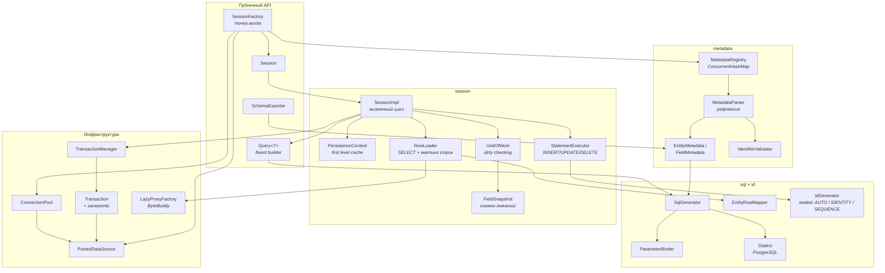

# MicroORM

[](https://openjdk.org/)
[](https://github.com/actions/workflows/build.yml)
[](LICENSE)
[](pom.xml)
[](https://jacoco.io)

Учебный мини-ORM поверх чистого JDBC. Ни Hibernate, ни JPA, ни Spring, ни Lombok: только
`java.sql`, стандартная библиотека, SLF4J и ByteBuddy для ленивых прокси.

```
Java 21 · Maven · PostgreSQL · 81 файл / ~6350 строк main · 283 юнит-теста + 8 IT-наборов
```

---

## Что это и зачем

Hibernate — чёрный ящик: вы пишете `@Entity`, а под кадром происходит магия с прокси, кэшем первого
уровня, dirty checking и пулом соединений. Магия удобна, но именно поэтому непонятна: когда ORM
делает `UPDATE` по всем колонкам, а запрос уходит в базу дважды, диагностировать это без понимания
внутренностей почти невозможно.

MicroORM решает ровно эту задачу в обратную сторону: реализует те же механизмы явно и в объёме,
который можно прочитать за вечер. Здесь нет «магии без объяснения» — каждое решение снабжено
комментарием `// NOTE:` с причиной, а каждый механизм покрыт тестом, который проверяет конкретное
поведение, а не «не упало».

Проект не претендует на production-готовность и не пытается быть заменой Hibernate. Он претендует на
то, что после его чтения вы сможете объяснить коллеге, почему `session.find()` вернул тот же объект,
который вы уже меняли, и почему два потока, редактирующих одну строку, приводят к
`OptimisticLockException`.

---

## Quick start

Пример ниже выполняется тестом [`ReadmeExampleTest`](src/test/java/io/microorm/session/ReadmeExampleTest.java),
а те же сценарии против настоящего PostgreSQL проверяет
[`CrudIT`](src/test/java/io/microorm/it/CrudIT.java) — README не может разъехаться с кодом.

```java
PGSimpleDataSource dataSource = new PGSimpleDataSource();          // 1. обычный JDBC DataSource
dataSource.setUrl("jdbc:postgresql://localhost:5432/microorm");

SessionFactory factory = SessionFactory.builder()                 // 2. фабрика: DataSource + пул + метаданные
        .connectionPool(dataSource, PoolConfig.builder().minSize(2).maxSize(8).build())
        .entities(User.class, Order.class)
        .build();

try (Session session = factory.openSession()) {                    // 3. сессия = unit of work
    session.beginTransaction();
    session.persist(new User("ann@example.com", "Ann", 30, true));  //    id сгенерирует БД
    session.commit();
}

try (Session session = factory.openSession()) {
    User ann = session.findOrThrow(User.class, 1L);               // 4. find: кэш первого уровня
    ann.setName("Anna");                                           // 5. меняем поле

    session.beginTransaction();
    session.commit();                                              //    flush -> UPDATE только name + version

    List<User> adults = session.createQuery(User.class)            // 6. fluent-запрос
            .where("age", ">", 18)
            .and("active", "=", true)
            .orderBy("name", SortDirection.ASC)
            .limit(10)
            .list();
}
```

Сгенерировать DDL для этой схемы:

```java
factory.schemaExporter().exportToConsole(factory.knownEntities());
// CREATE SEQUENCE IF NOT EXISTS orders_id_seq;
// CREATE TABLE users (
//     id BIGINT GENERATED BY DEFAULT AS IDENTITY PRIMARY KEY,
//     email VARCHAR(255) NOT NULL,
// ...
// ALTER TABLE orders ADD CONSTRAINT fk_orders_user_id FOREIGN KEY (user_id) REFERENCES users (id);
```

---

## Архитектура



Ключевое решение: **`SessionImpl` ничего не знает про SQL-текст, а `SqlGenerator` ничего не знает про
сессию.** Первый занимается жизненным циклом, второй превращает метаданные и значения в строку
запроса. Благодаря этому «какие колонки считаются изменёнными» проверяется юнит-тестом без базы.

---

## Как это работает

### Как парсятся метаданные

`MetadataParser` обходит `getDeclaredFields()` и на каждом поле принимает решение:

| Ситуация | Результат |
|---|---|
| `static`, `synthetic`, `transient`, `@Transient` | пропускается |
| `@Id` | и идентификатор; тип ограничен `Long`, `Integer`, `UUID` |
| `@Version` | и версия; тип ограничен целочисленным |
| `@ManyToOne` | поле-ассоциация, колонка = `joinColumn` или `<поле>_id` |
| `@OneToMany` | `UnsupportedOperationException` на этапе парсинга |
| базовый тип | обычная колонка, имя = `@Column#name` или `snake_case(поле)` |
| что-то ещё | `MappingException` со списком допустимых вариантов |

Ключевое: **ошибки маппинга возникают при первом обращении к метаданным, а не посреди транзакции**.
Парсер заранее проверяет наличие no-arg конструктора, единственность `@Id`, тип `@Version` и то, что
класс с ленивой ассоциацией не `final` (иначе ByteBuddy не сможет создать подкласс).

Имя таблицы: `@Table(name)` → `@Entity(table)` → `snake_case(ИмяКласса)`. Имя колонки по умолчанию —
`snake_case(имяПоля)`, поэтому всё, что попадает в SQL, удовлетворяет `IdentifierValidator`
(`^[a-z_][a-z0-9_]*$`).

Результат кэшируется в `MetadataRegistry` (`ConcurrentHashMap`): парсинг одного класса происходит
ровно один раз, о чём есть отдельный тест с 16 потоками.

### Что такое Persistence Context и зачем он нужен

`PersistenceContext` — это `Map<Class, Map<Id, Entity>>`, живущий внутри сессии. Он даёт две
гарантии:

1. **Идентичность.** Одна строка — один объект в рамках сессии. Поэтому
   `session.find(u, 1L) == session.find(u, 1L)`, и изменение через одну ссылку видно через все.
2. **Отсутствие повторного SQL.** Второй `find` того же идентификатора не ходит в базу вообще:
   `SessionStatistics` показывает `cacheHits`.

Важная деталь: если строка читается из базы повторно (через `findAll` или запрос), а объект уже
управляется сессией, **побеждает управляемый объект** — значения из строки копируются в него. Иначе
`find` мог бы выдать второй объект той же строки, а dirty checking увидел бы только более новый из
двух.

Кэш первого уровня живёт ровно одну сессию. Кэша второго уровня здесь нет намеренно (см. раздел
«Что не поддерживается»).

### Как работает Dirty Checking

Механизм состоит из трёх частей:

1. **`FieldSnapshot.capture`** — при загрузке (или после успешной записи) сохраняется снимок значений
   всех обновляемых колонок и версии. Массивы копируются, иначе изменение `byte[]` «на месте» не было
   бы замечено (`Objects.deepEquals`).
2. **`FieldSnapshot.changedColumns`** — на `flush()` текущие значения сравниваются со снимком;
   возвращаются только действительно изменившиеся колонки.
3. **`SqlGenerator.update`** — строит `UPDATE` ровно по этим колонкам, плюс `version = version + 1`,
   а в `WHERE` добавляет `AND version = <загруженная версия>`.

Побочный эффект, который стоит знать: если вернулить изменённое поле к исходному значению, `UPDATE` не
выполнится вообще — сравнение идёт со снимком момента загрузки, а не с предыдущим `flush`.

```java
User ann = session.findOrThrow(User.class, 1L);  // SELECT, snapshot = {name=Ann, age=30, version=0}
ann.setName("Anna");
// flush -> UPDATE users SET name = ?, version = ? WHERE id = ? AND version = ?
//         [Anna]                             [1]          [1]            [0]
```

`UnitOfWork` намеренно не знает про JDBC: он возвращает `List<Change>` (sealed-интерфейс из
`Insert`/`Update`/`Delete`). Поэтому «какие колонки изменились» тестируется без базы, а
`SessionImpl.flush()` — это исчерпывающий `switch` по трём видам изменений.

### Как работает Lazy Loading (ByteBuddy-прокси)

`LazyProxyFactory.createProxy` генерирует подкласс сущности в памяти:

```java
new ByteBuddy()
    .subclass(User.class)
    .name("...User$MicroOrmProxy")
    .implement(EntityProxy.class)
    .defineField("$$microOrmState", ProxyState.class, Visibility.PRIVATE)
    .defineField("$$microOrmId", Long.class, Visibility.PRIVATE)
    .method(named("getId")).intercept(FieldAccessor.ofField("$$microOrmId"))
    .method(not(named("getId")).and(not(named("isMicroOrmInitialized"))))
          .intercept(MethodDelegation.to(LazyInitInterceptor.class))
    .make().load(...).getLoaded();
```

Ключевые решения и почему они такие:

- **`@SuperCall Callable<?>`** в интерсепторе — аналог `super.method(...)`. После инициализации вызов
  уходит в настоящую реализацию сущности, поэтому прокси «становится» полноценным объектом: копия
  состояния не нужна и не происходит.
- **`getId()` отвечает из поля**, а не вызывает загрузчик. Идентификатор известен заранее, поэтому
  `order.getUser().getId()` не вызывает SELECT. Отдельное поле `$$microOrmId` нужно потому, что
  `FieldAccessor` ищет поля только в самом сгенерированном классе, а `id` объявлен в суперклассе и
  обычно приватен.
- **`equals`/`hashCode` — identity**, как у ссылки на ещё не загруженную строку.
- **Классы прокси кэшируются по типу сущности.** Без кэша каждый прокси порождал бы свой класс, и
  `getClass()` удивлял бы.
- **`ProxyState` — обычный класс, а не record:** флаг инициализации мутируемый, а record-компонент
  даёт финальный аксессор.

Если сессия закрыта, а прокси всё ещё жив, вызов любого свойства кроме `getId()` даёт
`LazyInitializationException` — ровно то самое поведение, ради которого в Hibernate придумали
`OpenSessionInView`.

### Как устроен Connection Pool

`ConnectionPool` сознательно не делает ничего сверх пяти задач:

1. держит от `minSize` до `maxSize` физических соединений;
2. выдаёт соединение и забирает обратно на `close()`;
3. не создаёт неограниченное число соединений, а блокирует вызывающего и сдаётся через
   `connectionTimeout` с `ConnectionPoolException`;
4. проверяет переиспользуемое соединение `validationQuery` (`SELECT 1` по умолчанию);
5. списывает соединения, вышедшие за `idleTimeout` или `maxLifetime`.

Соединение оборачивается в `java.lang.reflect.Proxy` (`PooledConnection`), где перехватываются всего
четыре метода: `close()` (возврат в пул, идемпотентный), `isClosed()`, `equals`/`hashCode`/`toString`.
Писать делегирующий класс на 50 методов ради одной переопределённой семантики — плохая сделка, и
все production-пулы делают ровно то же самое.

Истечение ленивое: проверяется при ближайшем borrow/return, а не фоновым таймером. Пул, которым никто
не пользуется, не должен иметь собственного потока, который нужно корректно останавливать.

Для тестируемости `PoolConfig` принимает `Clock`, поэтому `idleTimeout` и `maxLifetime` проверяются без
`sleep`, а дедлайн соединений не зависит от системного времени.

---

## Что не поддерживается и почему

| Не поддерживается | Причина |
|---|---|
| `@OneToMany`, `@ManyToMany` | Коллекция требует отслеживания изменений её элементов — это самая «невидимая» магия в ORM. Здесь её нет: аннотация `OneToMany` приводит к `UnsupportedOperationException` на этапе парсинга метаданных, то есть проблема обнаруживается при старте, а не в проде. |
| Наследование сущностей | Каждая стратегия (single table, joined, table per class) добавляет слой к SQL-генератору и к dirty checking. Одиннадцать строк кода «поддержки» здесь означали бы три неразобранных подсистемы. |
| Кэш второго уровня | Требует инвалидации между процессами, то есть распределённой проблемы. Для учебного проекта это первое, что можно убрать и не потерять понимание основ. |
| Criteria API с compile-time проверкой | Требует статического анализа вызовов или генерации кода. Строковый builder проверяется в рантайме — проще и честнее. |
| MySQL / Oracle | Требует второго `Dialect`. Он есть как интерфейс с пятью методами, но непроверенная реализация — мёртвый код. |
| Каскады и `orphanRemoval` | Каскадное удаление — политика, а не механизм; она должна быть в доменной модели, а не в ORM. |
| `@Embedded`, `@ElementCollection`, наследование встраиваемых типов | Каждый добавляет свой путь маппинга и свои правила dirty checking. |
| Composite primary keys | Требовали бы составного ключа в `PersistenceContext` и в `Change`. |
| Авто-коммит для записей | `persist`/`merge`/`remove`/`flush` требуют транзакции, иначе `TransactionRequiredException`. Полузаписанный агрегат ищется дольше, чем падение с внятным сообщением. |

Осознанное отклонение от исходного ТЗ: `Session.find` возвращает `Optional<T>`, а не `T`. Публичный API
без `null` — сознательное решение; для случая «обязательно должен существовать» есть `findOrThrow`,
который бросает `EntityNotFoundException`.

---

## Бенчмарки

`FindByIdBenchmark` сравнивает три варианта. Во всех трёх на каждой операции открывается и закрывается
unit of work, все работают через один и тот же пул, SQL и проекция одинаковы. Разница — только
накладные расходы ORM.

```bash
mvn -q test-compile
mvn -o dependency:build-classpath -Dmdep.outputFile=target/cp.txt -Dmdep.includeScope=test
java -cp "target/classes:target/test-classes:$(cat target/cp.txt)" org.openjdk.jmh.Main \
    io.microorm.benchmark.FindByIdBenchmark -bm avgt -wi 5 -i 5 -w 2s -r 3s -f 2 -tu us
```

| Сценарий | Score, мкс/оп | Error | Отн. к JDBC | SQL за операцию |
|---|---:|---:|---:|---:|
| `plainJdbcFindById` — тот же SQL через `PreparedStatement` | **202,5** | ± 42,3 | 1,00× | 1 |
| `microOrmFindById` — полный путь ORM | **257,3** | ± 56,1 | 1,27× | 1 |
| `microOrmFindByIdTwice` — второй `find` из кэша первого уровня | **238,3** | ± 65,1 | 1,18× | 1 |

Условия: PostgreSQL 16.2 на той же машине (локальный сервер, без контейнера), JMH 1.37, 2 форка,
5 итераций по 2 с прогрева и 5 по 3 с замера, `AverageTime`.

Как это читать:

- **ORM дороже JDBC на ~27%** — и это цена за то, что он делает: создание сессии и persistence context,
  поиск метаданных, маппинг 8 колонок рефлексией и снимок значений для dirty checking.
- **Второй `find` той же строки почти ничего не стоит** (~19 мкс, разница 257 → 238): это чистая экономия
  кэша первого уровня, SQL не выполняется вовсе.
- Абсолютные значения высокие (~200 мкс), потому что база и клиент на одной машине и каждый `SELECT`
  идёт через диск. Для сравнения ORM с ORM это неважно, для сравнения «быстро/медленно» — важно.

Hibernate в таблице нет намеренно: это не зависимость проекта, а измерять то, чего нет в classpath,
значит выдумывать числа. Сравнение «MicroORM против чистого JDBC» — единственное, которое здесь
воспроизводимо одной командой.

## Как запустить тесты

```bash
mvn clean verify
```

`verify` выполняет:

1. **юнит-тесты** — SQL-генератор, парсинг метаданных, dirty checking, пул соединений, транзакции,
   query builder, ленивые прокси, пример из README (283 теста, без базы);
2. **интеграционные тесты** — Testcontainers поднимает `postgres:16-alpine`, применяет
   `src/test/resources/docker/init.sql`, после чего выполняются 8 наборов (`*IT`);
3. **jacoco** — сбор покрытия и проверка порога 80% по строкам.

Интеграционные тесты требуют PostgreSQL. По умолчанию его поднимает Testcontainers, но если демона
нет, тесты **пропускаются**, а не падают: используется `Assumptions.assumeTrue`, и сборка остаётся
зелёной.

Чтобы прогнать их без Docker, укажите любой доступный PostgreSQL:

```bash
mvn clean verify \
  -Dmicroorm.jdbcUrl=jdbc:postgresql://127.0.0.1:5432/microorm \
  -Dmicroorm.jdbcUser=postgres -Dmicroorm.jdbcPassword=postgres
```

Схема применяется из того же `docker/init.sql` в обоих режимах. Именно так все 57 интеграционных
тестов были прогнаны при разработке — на сервере PostgreSQL 16.2, распакованном из бинарников.

Что проверяют интеграционные тесты:

| Набор | Сценарии |
|---|---|
| `CrudIT` | persist → find → update → remove, first-level cache, dirty UPDATE, `merge`, нарушения ограничений |
| `TransactionIT` | commit, rollback, откат незавершённой транзакции при закрытии сессии, savepoint, REPEATABLE READ |
| `OptimisticLockingIT` | два потока на одной строке — ровно один победил, версия инкрементируется, конфликт при удалении |
| `LazyLoadingIT` | `getReference` не ходит в БД, загрузка ровно один раз, `LazyInitializationException` после `close()` |
| `QueryIT` | все операторы, пагинация, `'; DROP TABLE users; --` как значение |
| `ConnectionPoolIT` | возврат соединения, насыщение пула, замена протухших и убитых соединений, метрики |
| `SchemaExporterIT` | сгенерированный DDL применяется к чистой схеме PostgreSQL |
| `IdGenerationIT` | `AUTO` → identity или sequence в зависимости от схемы, `SEQUENCE`, уникальность id |

Покрытие: **93% строк, 84% ветвей** по модулю — 293 юнит-теста плюс 57 интеграционных.

---

## Что я узнал, написав свой ORM

**Рефлексия — это не страшно, если результат кэшировать.** `Field.get` медленный, но парсинг метаданных
происходит один раз на класс. Всё, что читается в цикле, заранее превращается в `record` с готовым
`Field` — и горячий путь не платит за разбор аннотаций.

**SQL-текст и значения должны разделяться в типах, а не только в соглашениях.** `SqlStatement` несёт
`List<Bind>`, а `Bind` знает тип значения. Из-за этого «случайно склеить значение в строку» невозможно
на уровне компиляции, а не по договорённости. Идентификаторы склеиваются — их нельзя параметризовать,
поэтому их единственная защита — whitelist из метаданных.

**Идентичность объектов — это то, что отличает ORM от обёртки над JDBC.** Кэш первого уровня стоит
несколько строк кода, но без него `session.find()` после изменения объекта в другом месте вернул бы
новый экземпляр, и оптимистичная блокировка начала бы срабатывать ложно.

**Оптимистичная блокировка бесплатна только в двух случаях.** Её реальная цена — колонка `version` в
каждой изменяемой таблице и `UPDATE` с двумя дополнительными условиями. Всё остальное (снимок версии,
`WHERE version = ?`, проверка числа затронутых строк) — двадцать строк кода.

**Lazy loading — это не «NULL вместо объекта».** Прокси должен выглядеть как объект (`instanceof`
должен проходить), переживать инициализацию один раз и честно падать после закрытия сессии. ByteBuddy
делает это лучше, чем можно сделать вручную: `@SuperCall` решает задачу вызова `super`-реализации,
которую вручную пришлось бы решать через копирование состояния в прокси (так делает Hibernate в
случае некоторых конфигураций).

**Savepoint — это и есть «вложенная транзакция».** Никакой магии: JDBC не умеет ничего другого. Важно
правило — откат вложенной транзакции откатывает только внутреннюю работу, а внешний транзакционный
контекст остаётся валидным.

**Connection pool — это контракт о конкурентном доступе, а не просто коллекция.** `ReentrantLock` + `Condition` вместо
`wait/notify` — не стилистический выбор, а отсутствие гонок при пробуждении. Пул, который создаёт
соединение, не забронировав слот под лимит, в нагрузке превысит `maxSize` мгновенно.

**Юнит-тесты на фейке не заменяют настоящую базу.** Пул возвращал в idle свежую копию соединения,
но оставлял прежнюю копию в множестве учёта; проверка членства на втором `release` падала, и пул
утекал до полного насыщения. Юнит-тесты этого не видели: у них был замороженный `Clock`, а две копии
с одинаковым временем равны как records. На живой базе ошибка проявилась сразу — через пять тестов.
Второй урок из того же прогона: `Long`-поле над `INTEGER`-колонкой, которое драйвер конвертировать
отказывается, — не экзотика, а самая обычная расхождение схемы и entity. Общий вывод: фейк проверяет
логику, база проверяет контракты с драйвером, и пропускать второе нельзя.

**«Грязные данные» в ORM — это не то, что PostgreSQL называет dirty read, а незаписанные изменения.** Авто-`flush` перед каждым
чтением внутри транзакции — это то, что делает `find` после `setName()` предсказуемым. Hibernate
называет это `FlushMode.AUTO`, и это поведение стоит дешевле, чем альтернатива: неожиданный
`UPDATE` в конце транзакции.

---

## Лицензия

MIT — см. [LICENSE](LICENSE).